# 地铁周围

2023年上半年，我有缘收得一部1958年产的Konica III-L2 F/2.8。作为经常地铁通勤的学生，地铁成为我摸索胶片的早期题材。广州地铁是全国最繁忙的地铁之一，在广州地铁上，你可能遇到任何人、任何事，这些人、这些事在过去每天路过、发生一万次，在未来还会继续路过，继续发生——作为影像记录者，它让我感到丰富，充盈，安全。

我尝试了各种胶片形式、参数、创作风格和暗房手法，尝试利用每一种光线和纹理，影调和细节，清晰和模糊——这部六十五岁的相机带给我无限灵感和惊喜。

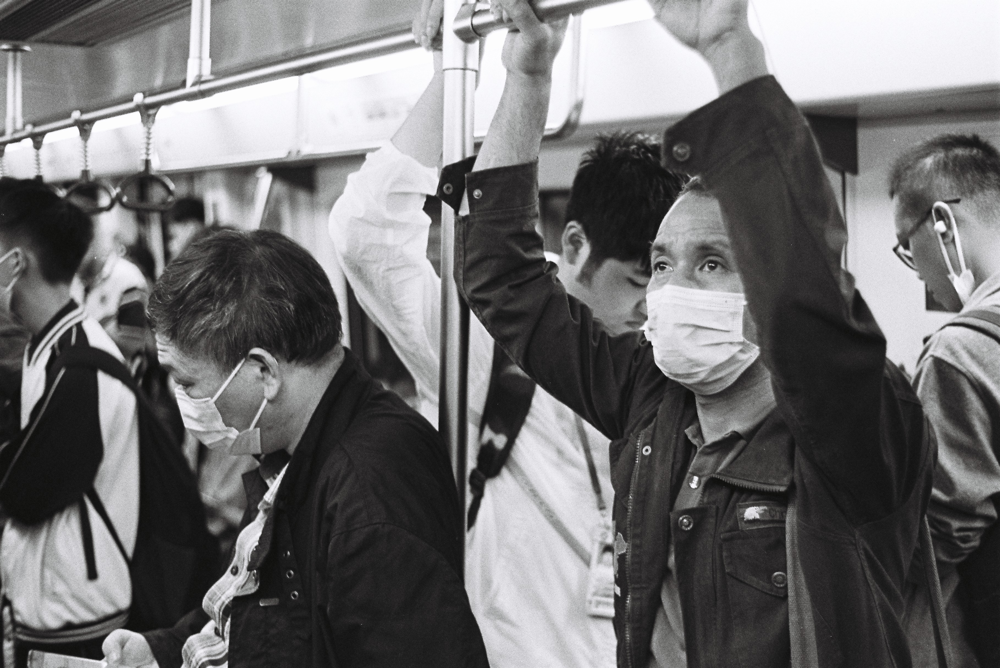

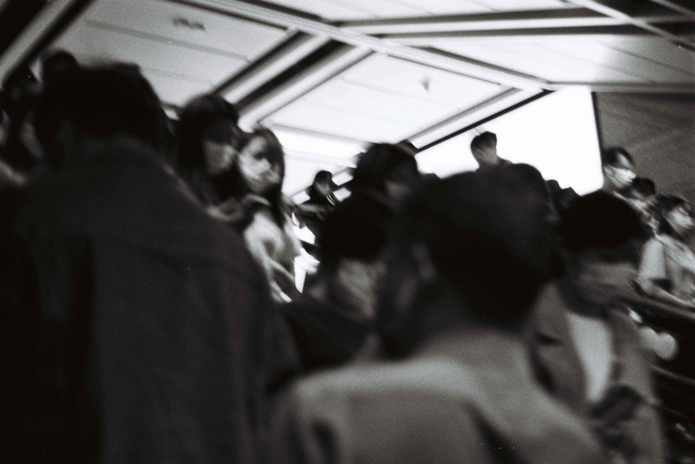

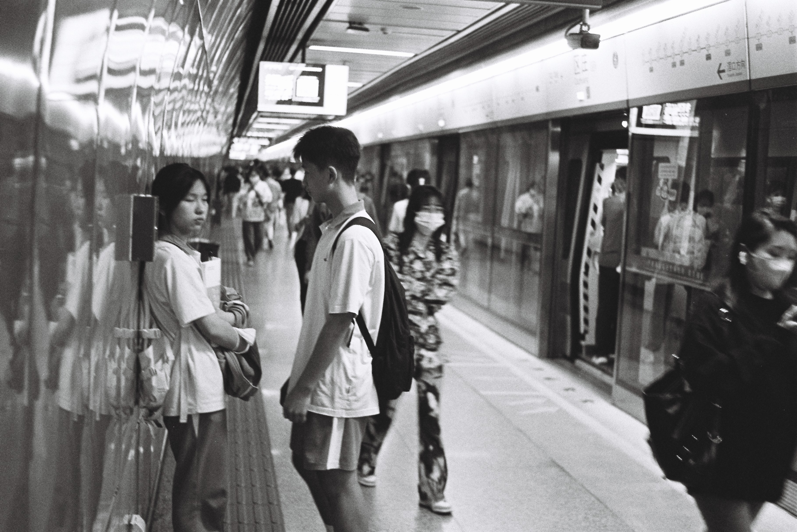

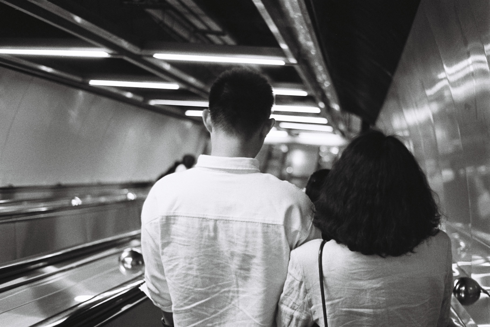

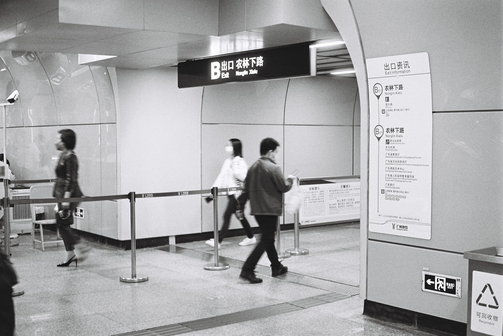

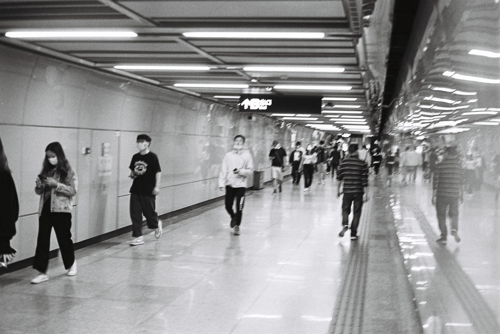

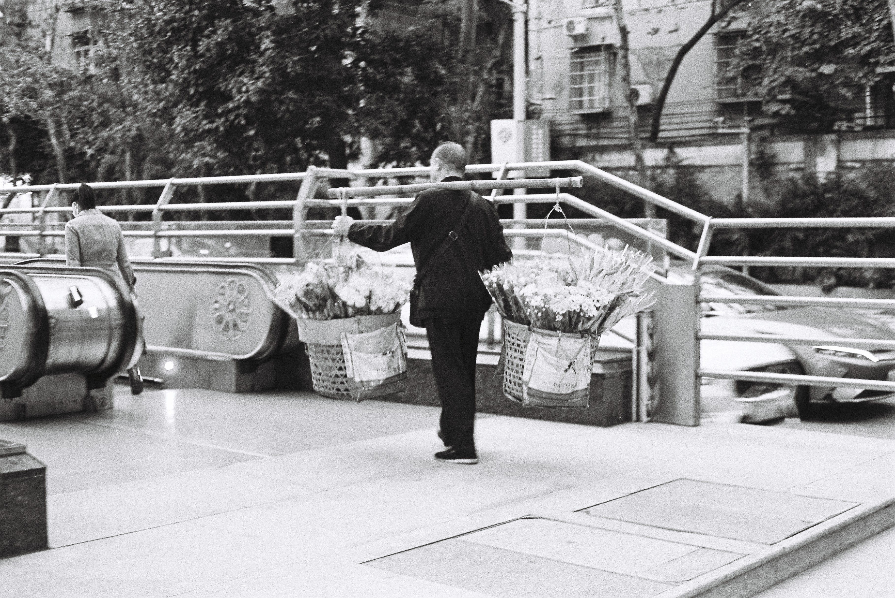

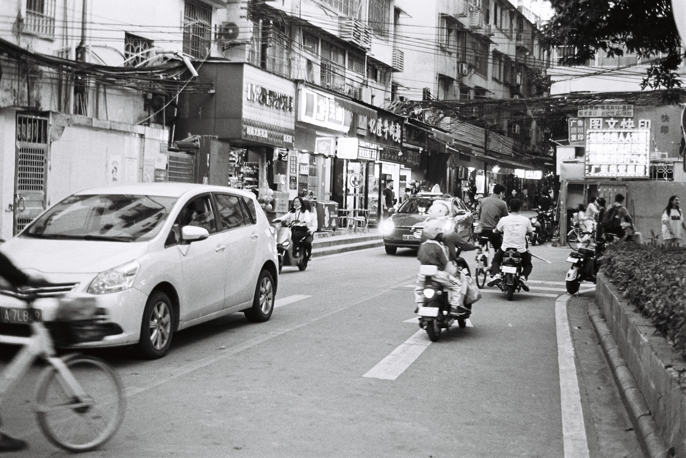

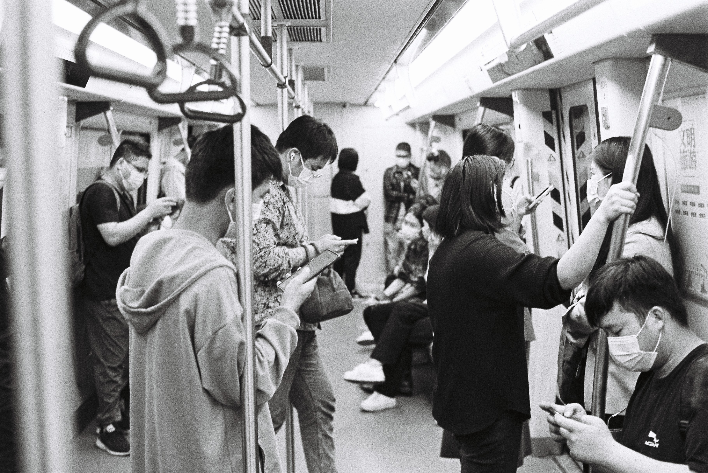

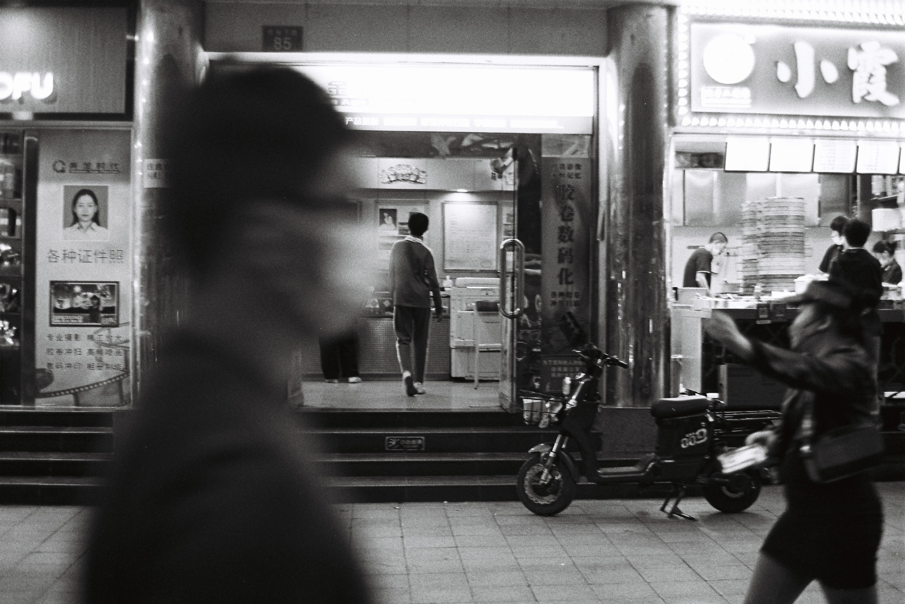

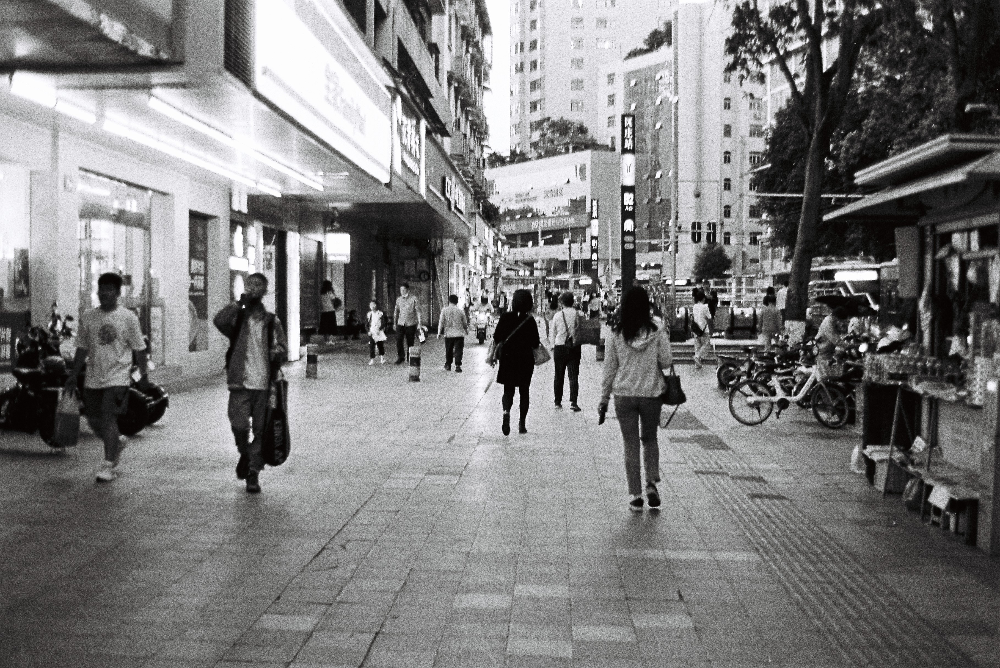

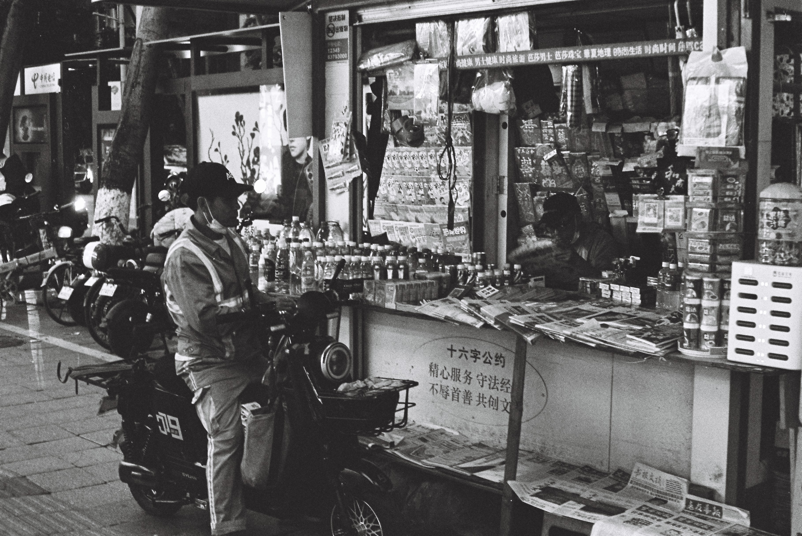

