# 大塘故事
大塘村是一个典型的广州城中村，村民大多从事轻纺行业。对于外面的世界而言，大塘村像一个黑盒子，订单进去，产品出来，与高速的现代社会完美融合。然而大塘村内部依然保持着十分传统的前现代面貌：被自建房挤压出的小巷堪堪可供两人并排穿行，狭窄的阳光被久也晾不干的衣服留下大半，加之空调和热水器淅淅沥沥的存在，即便大晴天也总像是阴雨天气；运用小型手动机械的家庭作坊随处可见；集体化的公共生活让人与人之间几乎不存在边界感，随处都能看到年迈的拾荒者和因炎热赤膊行走的人们；随心而聚的集市，作为原料和产品互通有无的空间；印刷粗糙的广告随处张贴，写着“乱贴死全家”的公告牌秩序井然，共同组成了信息沟通的主要媒介；老少皆宜的三轮车和风驰电掣的电动车，成为穿越村巷的主要物流运力；湖南人和广东人各自的宗族社会，形成一套水面之下的秩序；梁氏宗祠作为村里最宏伟的建筑之一，因其周围手机信号较好，成为年轻人自提快递和联机游戏的去处；自给自足的商店和餐馆开在深巷里，只有村子里的人会光临；人们开始用手机自娱自乐，耳机里播放的依然是从磁带听到CD再到流媒体的粤剧；唱跳直播的小网红，成为这里新的“明星”，最忠实的受众依然是线下观看鼓掌喝彩的阿公阿婆；能拍到“珠江三件套”的小桥成为网红打卡点，被最多的外来者光顾，实际上它是名副其实的“招工桥”，是当地闲散力工坐地等待零活的集散地；年轻人在这里出生，成长，学会这里的生活方式，然后成为它的一部分。我用一个月的空闲时间在这里停留，体验这里的人和物，逐渐理解人们的生存逻辑，也见证了村民们逐渐与我相机的侵略感达成和解，尝试记录普通又特别的大塘故事。

**侯天泽 摄**

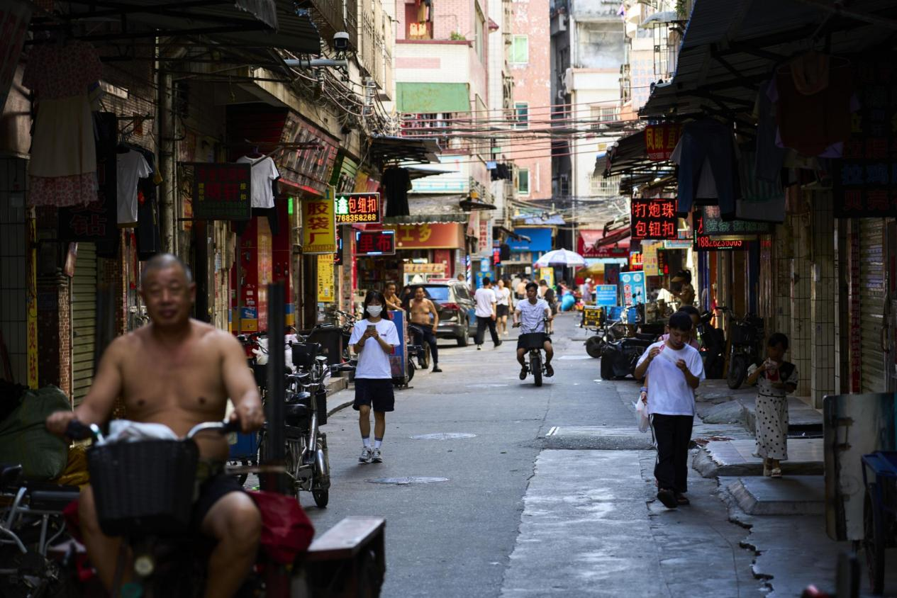

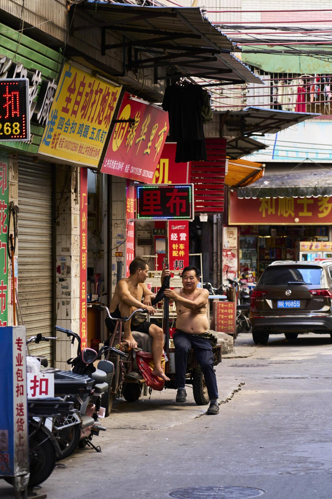

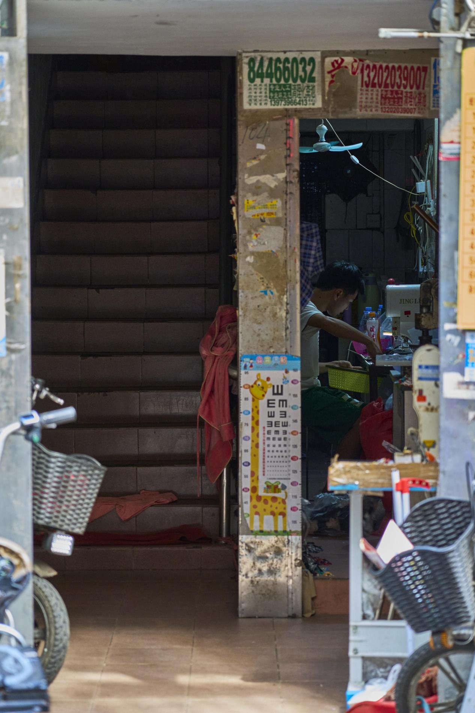

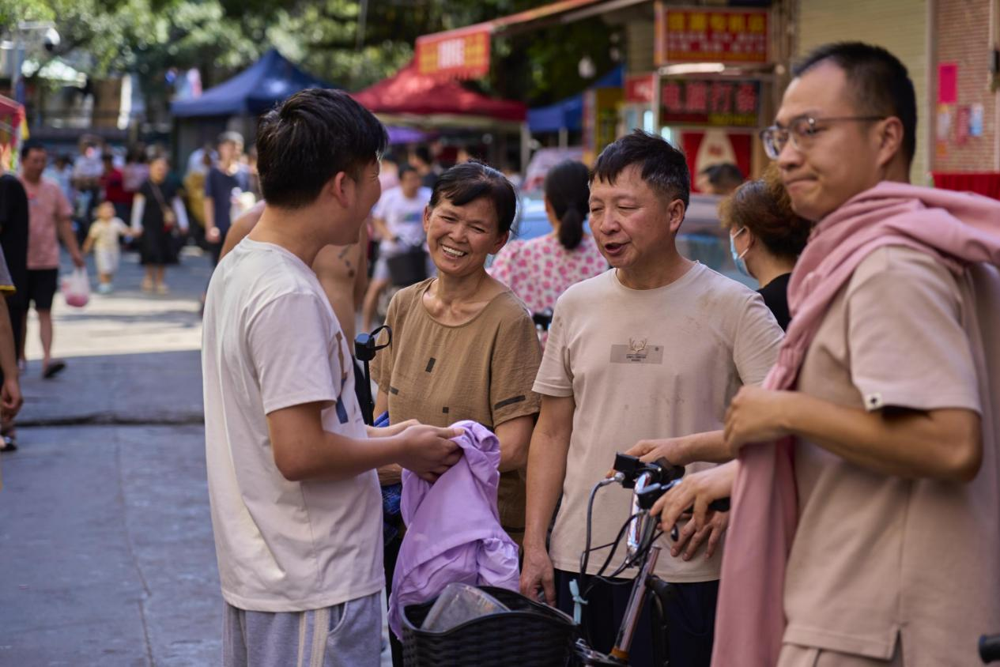

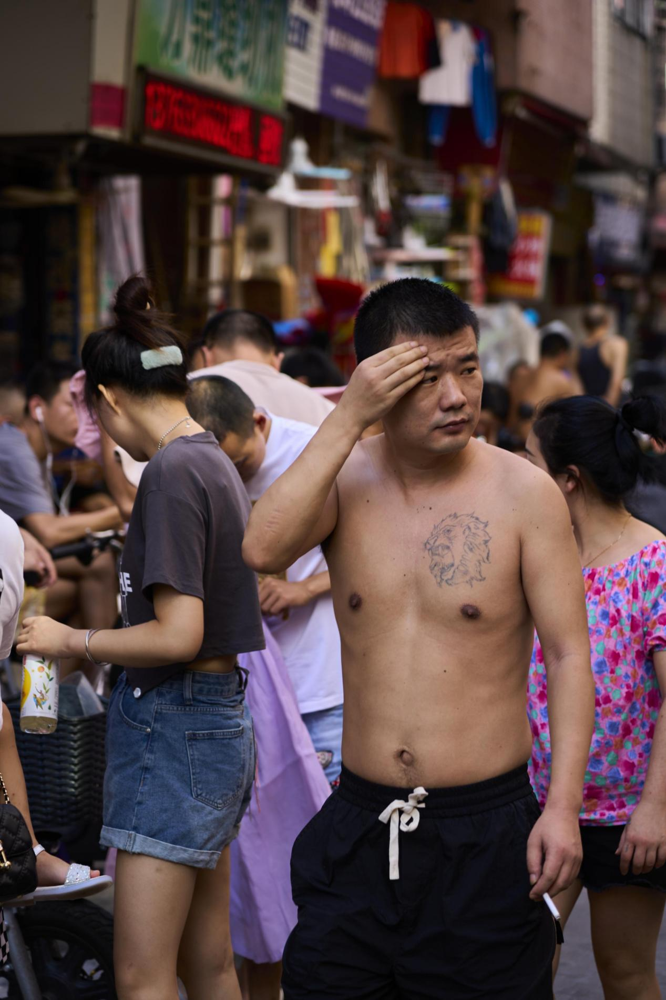

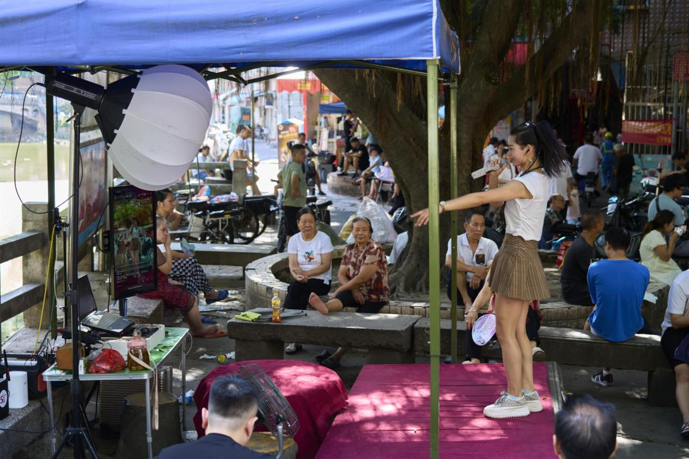

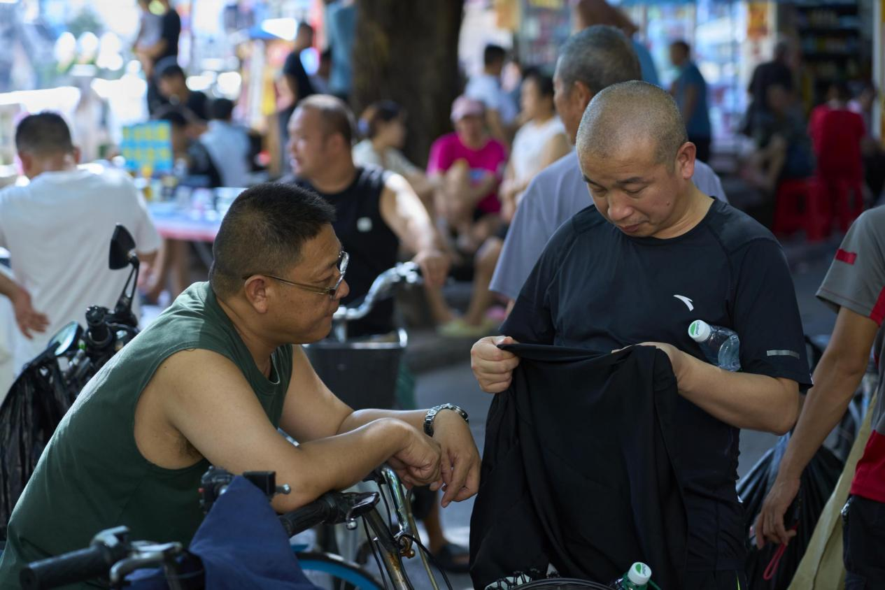

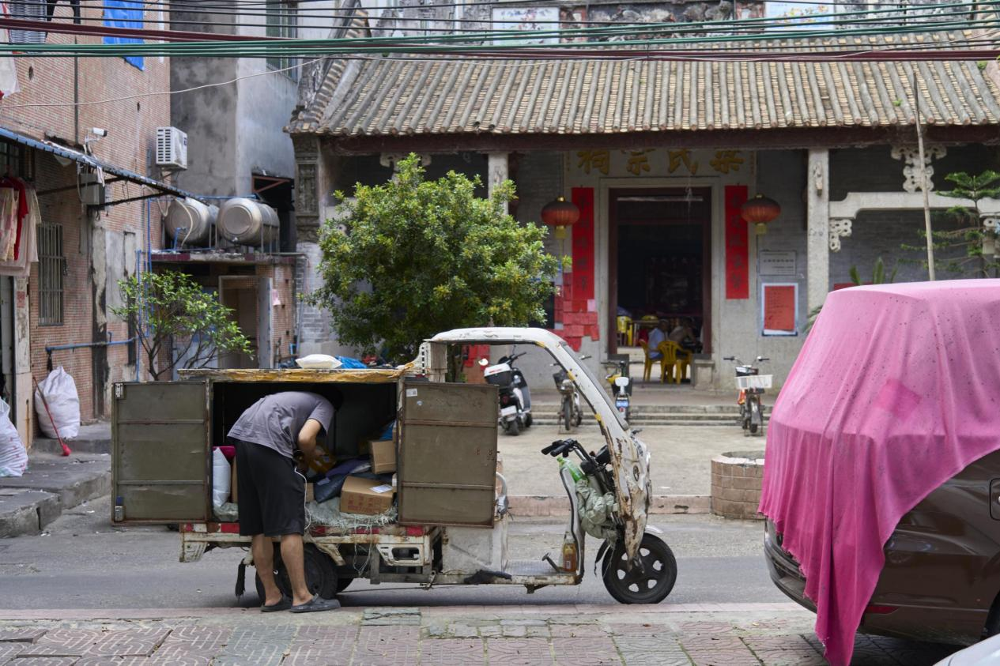

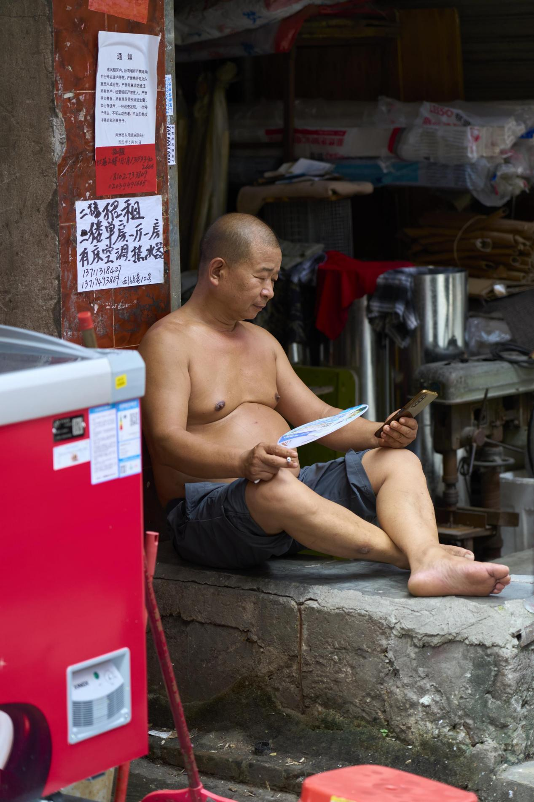

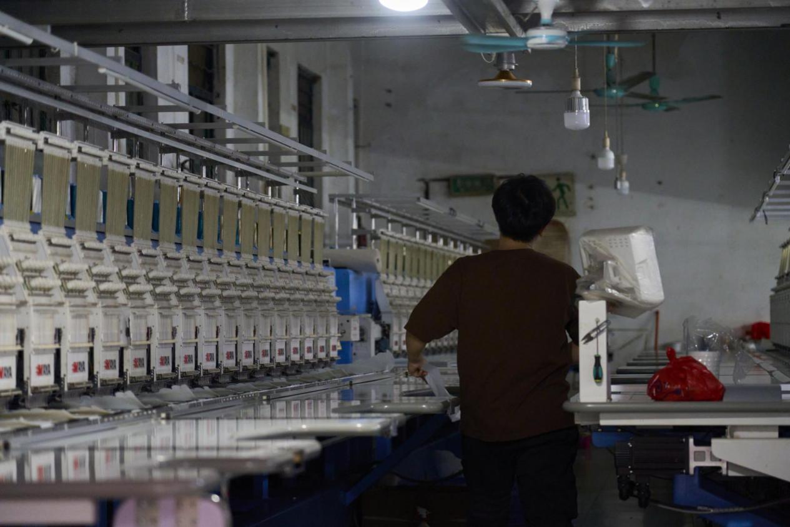

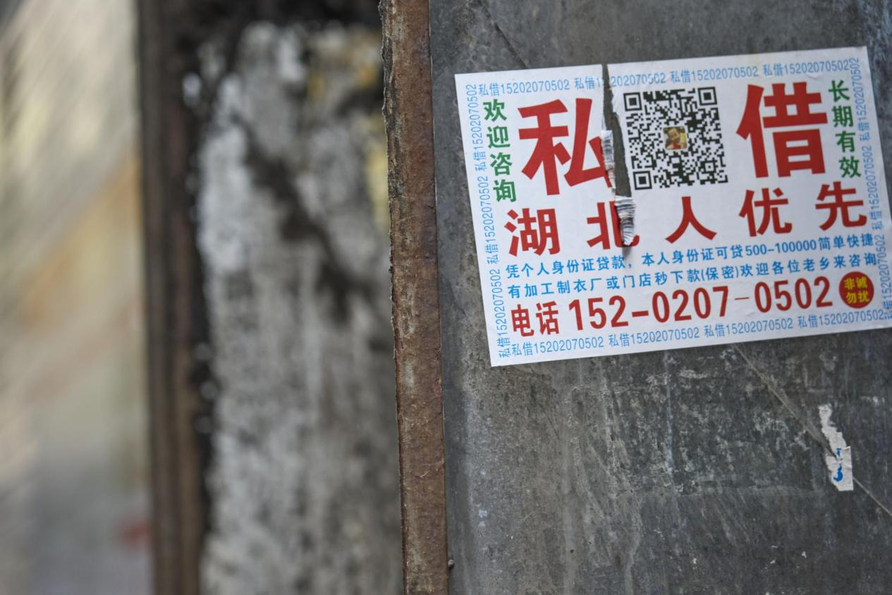

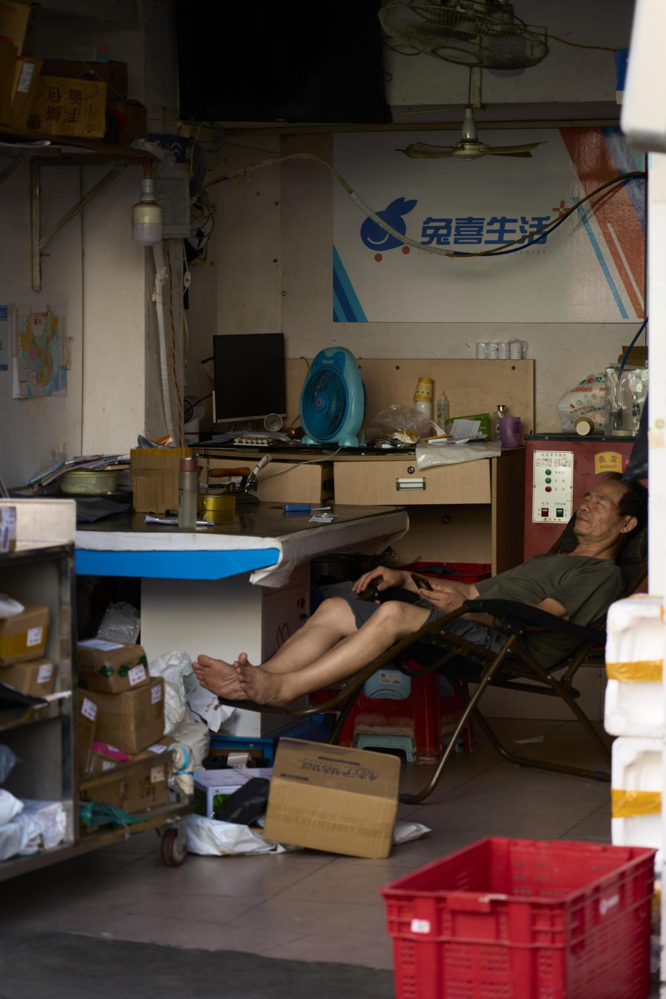

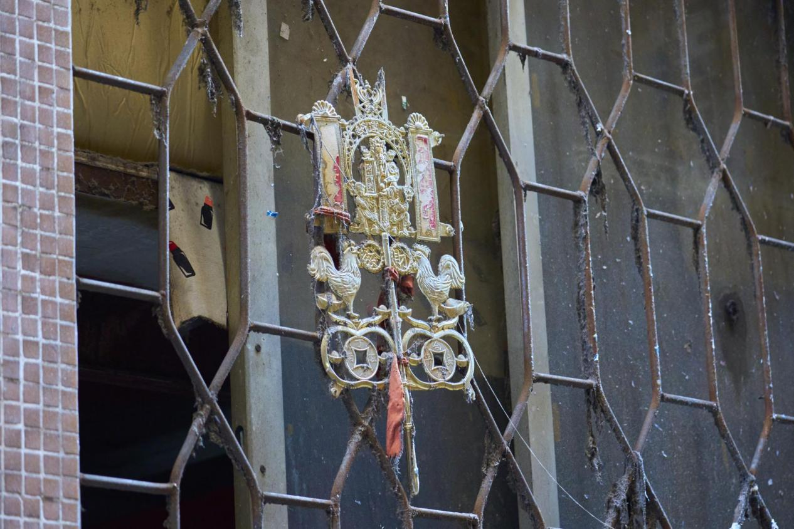

