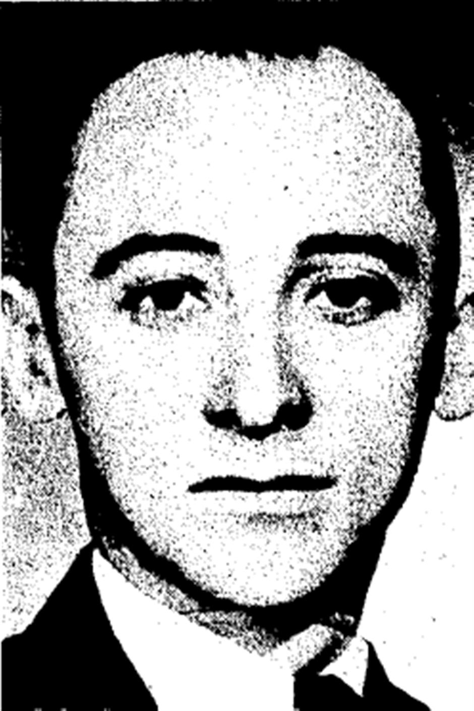
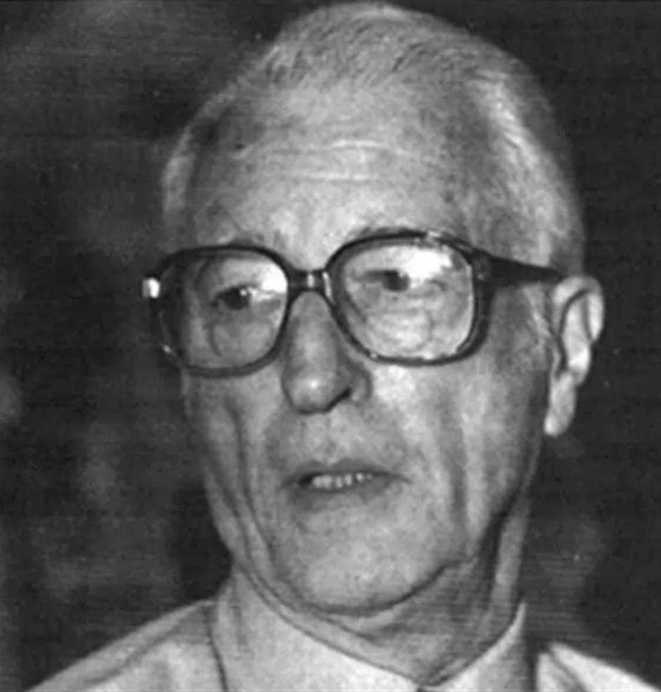
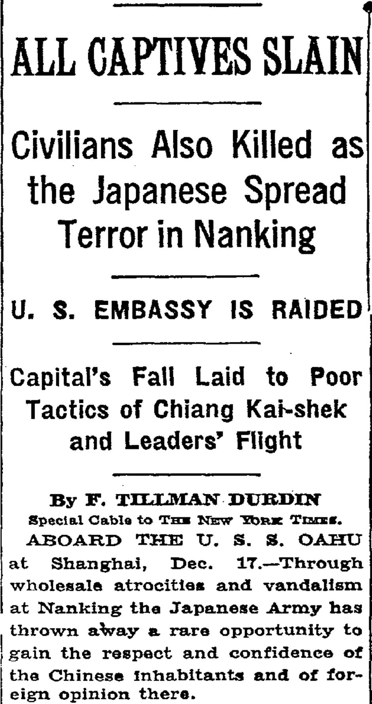
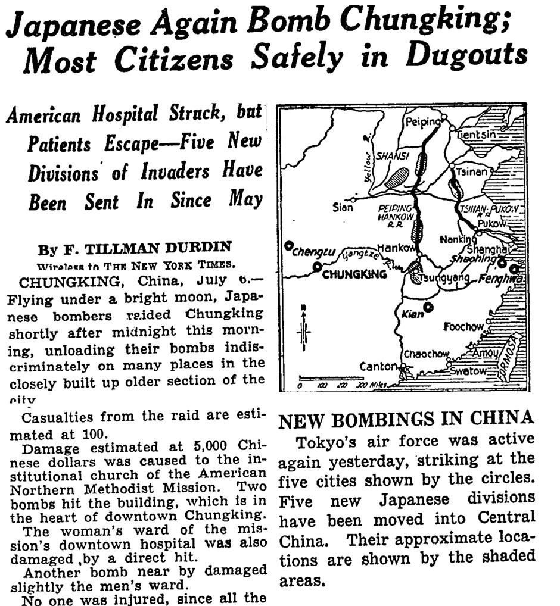
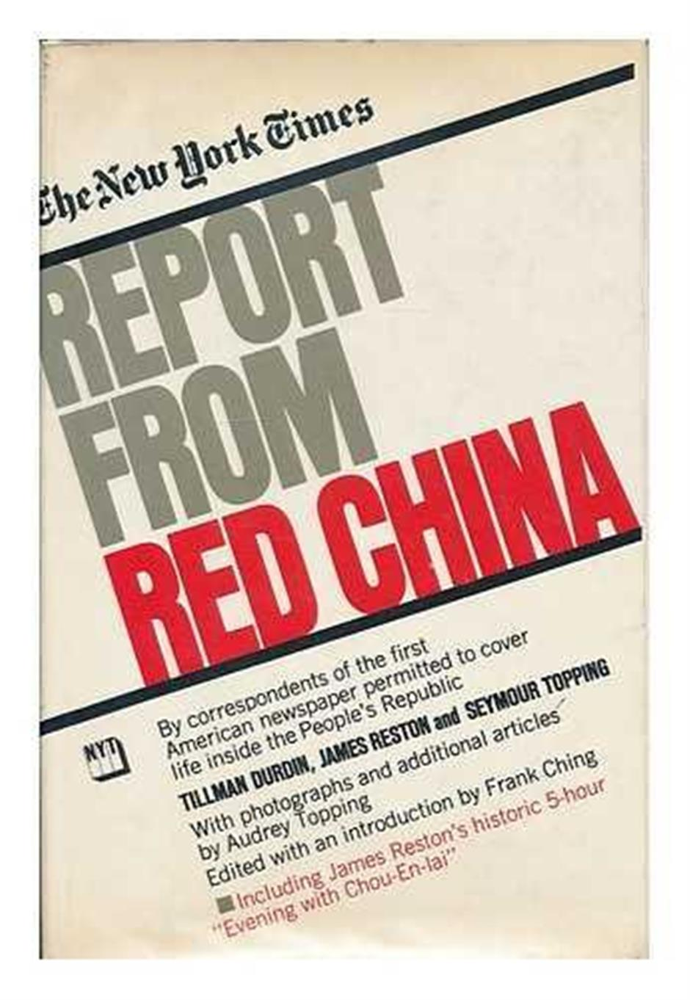

# The American reporter who revealed Nanjing and rediscovered China

> by Hou Tianze | September 24, 2025
> [City News Service](https://www.citynewsservice.cn/articles/shanghaidaily/in-focus/the-american-reporter-who-revealed-nanjing-and-rediscovered-china-zmabqron)

Frank Tillman Durdin's name is inextricably linked to one of the 20th century's great tragedies: the Nanjing Massacre. Among the first Western journalists to bear witness, he filed powerful front-page dispatches in 1937 that brought the horror to the world's attention. However, that moment alone does not define his story. It's the tale of a Texan who arrived on a whim and spent a lifetime chronicling China's profound struggles and transformations – building a career, meeting his wife, and returning decades later to find a nation reborn. Told in seven "days," this narrative traces the defining moments of his remarkable relationship with China.

**Caption**: A portrait of Frank Tillman Durdin, originally published in The China Press on October 10, 1936

## **Day 1: Shanghai, a new career and a lifelong love (1930s)**

In 1930, eager to see the world, Durdin left his newspaper job in Houston and worked his passage on a freighter. After months at sea, he came ashore in Shanghai.

Captivated by the energy of East Asia's most cosmopolitan city, Durdin decided to stay. He found work in Shanghai's thriving English-language press, first at the Shanghai Evening Post and later rising to managing editor of The China Press. The Shanghai of the 1930s – vibrant, jazz-soaked, and complicated – became the backdrop to the start of his long career as a foreign correspondent.

It was also in Shanghai that Durdin met his future wife, Margaret Armstrong. Born in China to American Presbyterian missionaries, Margaret had a lifelong connection to the country. After graduating from college in the United States, she returned to teach at Shanghai American School.

Sharing a similar background and a deep affection for China, they married in Shanghai in 1938, shortly after the events in Nanjing. Encouraged by her husband, Margaret began her own writing career under the byline Peggy Durdin, contributing to leading publications and becoming a respected journalist and author in her own right. Together, the Durdins became a formidable journalistic partnership.

## **Day 2: A voice from Nanjing, witness to atrocity (1937)**

In August 1937, as the war with Japan escalated, Durdin joined The New York Times as a special correspondent. His beat shifted from Shanghai's urban rhythms to the grim realities of conflict. Between August and December, he was in Nanjing, covering the relentless aerial bombardment and, ultimately, the city's fall.

**Caption**: Photo of Frank Tillman Durdin, from the Memorial Hall of the Victims in Nanjing Massacre by Japanese Invaders

Durdin was among the final five American journalists in Nanjing when the city fell on December 13. He became a direct witness to what followed: widespread looting and arson, mass executions of prisoners of war, and the killing of civilians. He reported Japanese troops systematically plundering homes and shops, terrorizing the civilian population even within the designated Safety Zone, and abducting and raping countless women.

With power and communications severed by the Japanese military, Durdin was unable to file, much to his frustration. On December 15, he was evacuated aboard the American gunboat USS Oahu. There, he wrote a comprehensive account of what he had seen. An officer rejected his first attempt to transmit the story over the ship's radio, citing it as a violation of regulations. Archibald Steele, a more seasoned correspondent for the Chicago Daily News, managed to persuade the radio operator to send a shorter bulletin, which became the first report of the massacre to reach the outside world.

Back in Shanghai, Durdin immediately cabled his full, detailed dispatch. On December 18, 1937, The New York Times ran it on the front page under the headline: "ALL CAPTIVES SLAIN; Civilians Also Killed as the Japanese Spread Terror in Nanking".

The article, continued at length inside the paper, provided a harrowing account:

The killing of civilians was widespread. Foreigners who traveled widely through the city Wednesday found civilian dead on every street. Some of the victims were aged men, women and children.

Policemen and firemen were special objects of attack. Many victims were bayoneted and some of the wounds were barbarously cruel.

Any person who ran because of fear or excitement was likely to be killed on the spot as was any one caught by roving patrols in streets or alleys after dusk. Many slayings were witnessed by foreigners.

The Japanese looting amounted almost to plundering of the entire city. Nearly every building was entered by Japanese soldiers, often under the eyes of their officers, and the men took whatever they wanted. The Japanese soldiers often impressed Chinese to carry their loot.

> ... The capture of Nanking was the most overwhelming defeat suffered by the Chinese and one of the most tragic military debacles in the history of modern warfare. In attempting to defend Nanking the Chinese allowed themselves to be surrounded and then systematically slaughtered.
> –*ALL CAPTIVES SLAIN; Civilians Also Killed as the Japanese Spread Terror in Nanking*, New York Times, December 18, 1937

**Caption**: Durdin's report "ALL CAPTIVES SLAIN; Civilians Also Killed as the Japanese Spread Terror in Nanking" at The New York Times on December 18, 1937

Durdin was among the first journalists to describe the events as a massacre and is often credited with originating the phrase "the Rape of Nanking," later popularized as the title of Iris Chang's 1997 book. His dispatches provided crucial, fresh evidence of the massacre, and in later years, he repeatedly and forcefully refuted attempts by Japanese revisionists to deny the historical record.

## **Day 3: Chongqing, reporting under fire (1939-1945)**

After leaving Nanjing, Durdin followed the war into China's interior, covering the conflict from the wartime capital of Chongqing. His reporting, often sympathetic to the Chinese cause, earned him access to the Nationalist government.

Life in Chongqing was perilous. The city endured relentless Japanese bombing raids that destroyed his home and damaged the British, German, and French consulates. In July 1939, he and Peggy hosted another American journalist, Edgar Snow. One night, during an air raid, Snow was inclined to stay in bed, citing the law of averages. Peggy, however, insisted they all retreat to one of the city's dugout shelters. They returned to find their house almost destroyed by a 500-pound bomb. The shared experience forged a lasting bond.

**Caption**: Durdin's report "Japanese Again Bomb Chungking; Most Citizens Safely in Dugouts" at The New York Times on July 6, 1939

Durdin's reporting from this period vividly captured the terror inflicted upon the civilian population. In a dispatch on July 6, 1939, he detailed the toll of 349 air raids between January and March 1939: 11,705 bombs dropped, 5,603 civilians killed, 6,833 injured, and 19,170 homes destroyed. These accounts brought home the human cost of the war for his readers, and he pressed for greater US aid to China.

## **Day 4: A firsthand witness (1947)**

After the war, Durdin re-established The New York Times bureau in Nanjing. His colleague, Seymour Topping, would later call him a role model who wrote more of the raw material of Chinese history than any other journalist he knew.

His reporting during this period covered the complexities of post-war China: the breakdown of negotiations, widespread social unrest, and the economic chaos of hyperinflation under the rule of the Kuomintang (KMT). In 1947, he and Peggy turned their attention to a significant event in the Taiwan region of China. At the time, he was one of the few journalists bringing firsthand stories from China.

On February 28, an incident in Taipei, where government agents beat a woman for selling untaxed cigarettes, ignited a massive, island-wide uprising against the perceived corruption and repressive governance of the newly arrived KMT administration. Peggy quickly reported on the event and its brutal suppression by KMT forces. Her article, "Terror in Taiwan," published in The Nation on May 24, 1947, was one of the few Western accounts to shed light on what became known as the "2.28 Incident." Their work from this era provided critical context for the historic political shifts that soon followed.

## **Day 5: Hong Kong and Bandung, a distant watch (1950s)**

In 1948, Durdin was awarded a prestigious Nieman Fellowship at Harvard University. He spent most of the next decade based in Hong Kong, where he covered Southeast Asia and closely monitored China. Reporting on China from the outside during the height of the Cold War and the McCarthy era in the US posed its own challenges, often framing stories within the context of the East-West ideological divide. In 1955, he reported from Indonesia on the landmark Bandung Conference, a gathering of Asian and African states. There, Peggy was deeply impressed by Chinese Premier Zhou Enlai, whom she described as "tough and supple-witted." In a later memoir, she added, "I have never known a more magnetic personality than Chou En-Lai."

## **Day 6: The thaw, a return to a transformed China (1971)**

In 1971, following the "Ping-Pong Diplomacy" that signaled a thaw in US-China relations, Durdin was among the first American journalists granted a visa to enter the People's Republic of China. After more than two decades, he returned to the country that had defined his career.

His series of articles, including "Shanghai Revisited: Now a Workaday City," painted a portrait of a nation transformed. He noted that foreign luxury goods had given way to practical, domestically produced items. Industries like shipbuilding and textiles were booming, and he highlighted Shanghai's world-leading advances in reattaching severed limbs. He observed a disciplined and spirited populace, a significant rise in the social status of women, and effective population control.

**Caption**: The collection of reports " The New York TImes Report from Red China", Published in February, 1972

He also noted problems such as industrial smog and a transportation system that was still largely reliant on bicycles. His dispatches offered a nuanced, firsthand look at a long-isolated nation, helping to demystify the PRC for an American audience and contributing to the favorable climate ahead of President Richard Nixon's historic visit in 1972.

## **Day 7: A final look, a lasting legacy (1980s)**

Durdin retired in 1974, but his connection to China endured. He was invited back in 1985 and was received by Deng Xiaoping.

In 1988, at 81, he returned to Nanjing to visit the newly completed Memorial Hall for the Victims of the Nanjing Massacre. There, standing before the displays of photographs and skeletal remains, the man who had witnessed the event half a century earlier wrote an article for the San Diego Union-Tribune, reaffirming the historical truth of the atrocities and noting the deep desire among the Chinese people that the tragedy be remembered.

For his role in exposing the massacre, Durdin is formally honored at the memorial hall as a cherished foreign friend who gave voice to victims who could not speak for themselves.

Frank and Peggy Durdin spent their final years in California. Their home was said to be a testament to their life abroad, filled with Asian art and artifacts collected over decades – mementos of a lifelong engagement with a country they had documented with courage, clarity, and a profound sense of shared history.

(The author is a second-year graduate student at the Journalism School, Fudan University)